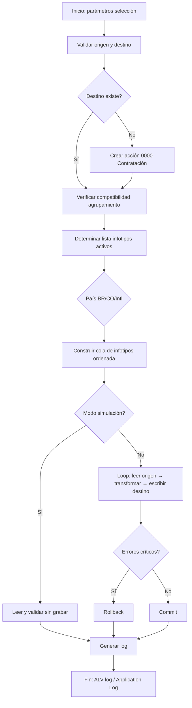

# Especificación: Clonador de Empleados SAP S/4HANA

| Campo | Valor |
|---|---|
| **Proyecto** | SAP S/4 Employee Cloner |
| **Versión spec** | 1.0.0 |
| **Estado** | Borrador — pendiente definición de infotipos Z |
| **Fecha** | 2026-06-10 |
| **Módulo SAP** | PA (Personnel Administration) + PY (Payroll) |
| **Release objetivo** | SAP S/4HANA (on-premise o Private Cloud) |

---

## 1. Resumen ejecutivo

Se requiere una solución ABAP para **clonar la información maestra de un empleado** (número de personal origen → número de personal destino) en SAP S/4HANA, copiando **todos los infotipos estándar** de Administración de Personal, incluyendo los **infotipos de nómina localizados para Brasil (BR)** y **Colombia (CO)**, más un conjunto extensible de **infotipos Z** que se definirán en una fase posterior.

El clonador **no duplica datos históricos de nómina procesada** (resultados de corrida, recibos, acumulados RT, etc.), sino la **configuración maestra del empleado** necesaria para operar en PA/PY: datos personales, asignaciones organizativas, datos bancarios, elementos recurrentes, datos fiscales/seguridad social localizados, etc.

---

## 2. Objetivos

| # | Objetivo |
|---|---|
| O1 | Reducir el tiempo de creación de empleados de prueba, sandbox o migración interna |
| O2 | Garantizar consistencia entre empleado origen y destino en infotipos estándar |
| O3 | Soportar localización de nómina BR y CO sin intervención manual extensa |
| O4 | Permitir extensión configurable para infotipos Z |
| O5 | Registrar trazabilidad completa de la operación de clonación |

---

## 3. Alcance

### 3.1 Dentro del alcance

- Clonación de infotipos PA estándar (ver catálogo sección 5).
- Clonación de infotipos de nómina localizados BR y CO (ver sección 6).
- Creación del empleado destino si no existe (acción de contratación mínima).
- Copia de registros con **fechas de validez** preservadas o ajustadas según reglas configurables.
- Modo **simulación (dry-run)** y modo **ejecución**.
- Log de operaciones, errores y advertencias.
- Configuración de infotipos Z vía tabla de customizing (pendiente lista del cliente).

### 3.2 Fuera del alcance (v1)

- Clonación de datos de **Time Management** (PT) salvo infotipos PA relacionados (0007, 2001–2003 si aplica).
- Clonación de **resultados de nómina** (tablas RT, BT, clusters PCL1/PCL2 de resultados).
- Clonación de **documentos adjuntos** (GOS/ArchiveLink) salvo requerimiento explícito futuro.
- Clonación entre **mandantes** diferentes.
- Clonación de usuarios SAP (SU01) vinculados al empleado.
- Sincronización bidireccional o actualización incremental.

---

## 4. Actores y casos de uso

### 4.1 Actores

| Actor | Rol |
|---|---|
| Consultor funcional HR/PY | Ejecuta clonaciones en QA/Sandbox |
| Desarrollador ABAP | Mantiene programa y customizing |
| Administrador de seguridad | Gestiona autorizaciones |
| Auditor | Revisa logs de clonación |

### 4.2 Casos de uso principales

```
UC-01  Clonar empleado completo (todos los infotipos en alcance)
UC-02  Clonar empleado con subconjunto de infotipos seleccionados
UC-03  Simular clonación sin persistir (dry-run)
UC-04  Clonar empleado destino ya existente (solo infotipos faltantes o sobrescribir)
UC-05  Clonar con ajuste de fechas (shift de validez)
UC-06  Re-ejecutar clonación de infotipos Z configurados
```

---

## 5. Catálogo de infotipos estándar (PA internacional)

Los infotipos listados corresponden al estándar SAP PA. La implementación debe leer el catálogo activo del sistema vía **T582A / T591A** y respetar la configuración del cliente.

### 5.1 Infotipos core (obligatorios)

| Infotipo | Descripción | Notas de clonación |
|---|---|---|
| **0000** | Acciones | Crear acción de contratación para empleado nuevo; no copiar acciones históricas del origen |
| **0001** | Asignación organizativa | Copiar registro vigente y histórico según parámetro |
| **0002** | Datos personales | Copiar; regenerar campos únicos si aplica (email, usuario) |
| **0006** | Direcciones | Copiar todos los subtipos |
| **0007** | Tiempo de trabajo planificado | Copiar |
| **0008** | Datos salariales básicos | Copiar; validar autorización |
| **0009** | Datos bancarios | Copiar; opcional enmascarar IBAN/cuenta en no-prod |
| **0014** | Pagos/descuentos recurrentes | Copiar registros vigentes e históricos |
| **0015** | Pagos adicionales | Copiar si existen |
| **0016** | Elementos de contrato | Copiar |
| **0017** | Privilegios de viaje | Copiar si aplica |
| **0021** | Familiares / dependientes | Copiar |
| **0022** | Formación | Copiar |
| **0023** | Empleos anteriores | Copiar |
| **0024** | Cualificaciones | Copiar |
| **0027** | Distribución de costes | Copiar |
| **0032** | Datos internos de personal | Copiar si está activo |
| **0033** | Estadísticas | Copiar |
| **0041** | Especificaciones de fecha | Copiar (fecha de ingreso, antigüedad, etc.) |
| **0105** | Comunicaciones | Copiar; limpiar valores únicos |
| **0185** | Documentos de identificación | Copiar; **validar unicidad** (CPF, cédula, DNI) |

### 5.2 Infotipos complementarios (estándar, incluir si activos en sistema)

| Infotipo | Descripción |
|---|---|
| 0003 | Estado nómina |
| 0004 | Desafío discapacidad |
| 0005 | Derecho a ausencias |
| 0010 | Formación de capital |
| 0011 | Transferencias externas |
| 0012 | Datos fiscales (genérico) |
| 0013 | Seguro social (genérico) |
| 0018 | Distribución de personal |
| 0019 | Monitorización de tareas |
| 0025 | Evaluaciones |
| 0026 | Especificaciones de fecha (alt.) |
| 0028 | Sanidad |
| 0034 | Datos de servicio |
| 0040 | Tipos de personal |
| 0048 | Información de residencia |
| 0049 | Datos de servicio anteriores |
| 0050 | Registro de información |
| 0057 | Membresías |
| 0081 | Datos de costes |
| 0094 | Estado de residencia |
| 0167 | Plan de salud |
| 0168 | Plan de seguro |
| 0169 | Beneficiarios |
| 0177 | Estado de residencia fiscal |
| 0208 | Datos de pago adicional |
| 0213 | Datos de tarjeta de crédito |
| 0216 | Datos de contrato adicional |
| 0233 | Datos de referencia |

> **Nota:** El programa debe consultar qué infotipos están activos para el **agrupamiento de personal** del empleado origen y replicar solo los aplicables al destino.

---

## 6. Infotipos de nómina localizados

### 6.1 Brasil (MOLGA = 37)

Infotipos típicos en implementaciones SAP HR/PY Brasil. Validar contra el sistema del cliente (transacción **PE03** / vista de infotipos por país).

| Infotipo | Descripción | Prioridad |
|---|---|---|
| **0185** | IDs: CPF, PIS/PASEP, RG, etc. | Alta — validar unicidad |
| **0002** | Datos personales (campos BR) | Alta |
| **0006** | Direcciones (formato BR) | Alta |
| **0016** | Contrato (tipo contrato CLT, etc.) | Alta |
| **0021** | Dependientes (IRRF, salario-família) | Alta |
| **0033** | Estadísticas (código municipio, etc.) | Media |
| **0094** | Estado de residencia | Media |
| **0177** | Residencia fiscal | Media |
| **0208** | Información adicional BR | Alta |
| **0216** | Datos contractuales BR | Alta |
| **0233** | Referencias bancarias BR | Media |
| **0057** | Sindicato / entidad | Media |
| **0048** | Información residencia BR | Media |

**Datos de nómina BR adicionales (tablas/vistas frecuentes):**

| Objeto | Descripción |
|---|---|
| T7BRxx | Reglas de cálculo y schemas BR |
| SEPA / eSocial | **No clonar** eventos eSocial transmitidos |
| IT0234 | Contribución sindical (si activo) |
| IT0529 | Información fiscal adicional (si activo) |
| IT0530 | Datos INSS (si activo) |
| IT0531 | Datos FGTS (si activo) |
| IT0532 | IRRF (si activo) |

> La lista exacta de infotipos 05xx debe confirmarse en el sistema BR del cliente. El diseño prevé tabla de configuración **ZHR_CLN_ITBR** para activar/desactivar por infotipo.

### 6.2 Colombia (MOLGA = 38)

| Infotipo | Descripción | Prioridad |
|---|---|---|
| **0185** | Cédula de ciudadanía, NIT, etc. | Alta — validar unicidad |
| **0002** | Datos personales CO | Alta |
| **0006** | Direcciones CO | Alta |
| **0016** | Contrato (tipo contrato laboral CO) | Alta |
| **0021** | Dependientes | Alta |
| **0033** | Estadísticas (código ciudad DANE, etc.) | Alta |
| **0094** | Estado de residencia | Media |
| **0177** | Residencia fiscal | Media |
| **0208** | Información adicional CO | Alta |
| **0216** | Datos contractuales CO | Alta |
| **0233** | Referencias / datos bancarios CO | Media |

**Datos de nómina CO adicionales (validar en cliente):**

| Infotipo / Objeto | Descripción |
|---|---|
| IT0377 | Seguridad social Colombia (EPS, AFP, ARL, cajas) |
| IT0378 | Retención en la fuente |
| IT0379 | Provisiones prestaciones sociales |
| IT0380 | Novedades de nómina |
| IT0381 | Datos de pago PILA |
| T7COxx | Schemas y reglas CO |

> Confirmar numeración exacta en **PE03** para MOLGA 38. El diseño prevé tabla **ZHR_CLN_ITCO** análoga a BR.

### 6.3 Resto de países

Para empleados cuyo **agrupamiento de personal** no sea BR ni CO, se clonan únicamente los **infotipos estándar internacionales** de la sección 5, sin infotipos de localización específicos.

---

## 7. Infotipos Z (pendiente de definición)

### 7.1 Estado

El cliente proporcionará posteriormente la lista de infotipos Z a incluir. El diseño debe soportarlos sin modificar código core.

### 7.2 Tabla de configuración propuesta: `ZHR_CLN_ITZ`

| Campo | Tipo | Descripción |
|---|---|---|
| MANDT | CLNT | Mandante |
| ITYPE | NUMC(4) | Número de infotipo Z |
| ACTIVE | XFELD | Activo |
| COPY_HIST | XFELD | Copiar histórico completo |
| COPY_CURR | XFELD | Copiar registro vigente |
| SUBTY_FILTER | CHAR(4) | Subtipo (opcional, blanco = todos) |
| EXCLUDE_FIELDS | STRING | Lista campos a excluir (separados por `;`) |
| POST_PROCESS | CHAR(30) | BAdI/método post-proceso (opcional) |
| REMARKS | CHAR(255) | Descripción |

### 7.3 Placeholder para definición del cliente

```
| Infotipo | Descripción | Subtipos | Campos a excluir | Notas |
|----------|-------------|----------|------------------|-------|
| ZXXX     | (pendiente) |          |                  |       |
| ZXXX     | (pendiente) |          |                  |       |
```

---

## 8. Reglas de negocio

### 8.1 Reglas generales

| ID | Regla |
|---|---|
| RN-01 | El empleado **origen** debe existir y estar activo o en baja; no clonar desde empleado inexistente |
| RN-02 | El empleado **destino** se crea con acción **01-Contratación** si no existe |
| RN-03 | Campos con **unicidad global** (CPF, cédula, email, usuario SAP) deben parametrizarse: `COPIAR`, `LIMPIAR`, `GENERAR_DUMMY` |
| RN-04 | Los infotipos se procesan en **orden de dependencia** (0000 → 0001 → 0002 → …) |
| RN-05 | Respetar **time constraints** (T591A/T591B); si hay solapamiento, decidir según modo: `ERROR`, `SOBRESCRIBIR`, `AJUSTAR_FECHA` |
| RN-06 | No copiar campos técnicos: `PERNR`, `AEDTM`, `UNAME`, `REPID`, `SEQNR` (regenerar en destino) |
| RN-07 | El **agrupamiento de personal** del destino debe ser compatible; si difiere, solo clonar infotipos válidos para el agrupamiento destino |
| RN-08 | Operación debe ser **commit explícito** solo al final si no hay errores críticos |

### 8.2 Reglas por país

| ID | Regla |
|---|---|
| RN-BR-01 | CPF y PIS deben ser únicos; en sandbox usar prefijo configurable (ej. `999...`) |
| RN-BR-02 | No clonar datos eSocial ya transmitidos |
| RN-CO-01 | Cédula y NIT deben ser únicos |
| RN-CO-02 | Validar códigos DANE, EPS, AFP, ARL contra tablas T7CO* |

### 8.3 Parámetros de selección (pantalla inicial)

| Parámetro | Tipo | Obligatorio | Descripción |
|---|---|---|---|
| P_PERNR_SRC | PERNR | Sí | Número personal origen |
| P_PERNR_TGT | PERNR | No | Número personal destino (vacío = crear nuevo) |
| P_BUKRS | BUKRS | No | Sociedad para nuevo empleado |
| P_WERKS | PERSA | No | División personal |
| P_BTRTL | BTRTL | No | Subdivisión personal |
| P_COPY_HIST | XFELD | No | Copiar histórico completo |
| P_SIMUL | XFELD | No | Modo simulación |
| P_OVERWRITE | XFELD | No | Sobrescribir infotipos existentes en destino |
| P_DATE_SHIFT | INT4 | No | Desplazar fechas N días |
| P_ITYPE_FROM | ITYPE | No | Rango infotipos desde |
| P_ITYPE_TO | ITYPE | No | Rango infotipos hasta |
| P_COUNTRY | LAND1 | No | Filtrar localización (BR/CO/blanco=todos) |

---

## 9. Arquitectura técnica

### 9.1 Componentes ABAP propuestos

```
┌─────────────────────────────────────────────────────────────┐
│  ZHR_EMPLOYEE_CLONER (Report / Transaction ZHR_CLONE)      │
├─────────────────────────────────────────────────────────────┤
│  ZCL_HR_CLN_ORCHESTRATOR   — Coordinador principal          │
│  ZCL_HR_CLN_ITYPE_FACTORY  — Factory por infotipo          │
│  ZCL_HR_CLN_ITYPE_BASE     — Clase abstracta infotipo       │
│  ZCL_HR_CLN_ITYPE_0002     — Implementación por infotipo    │
│  ZCL_HR_CLN_ITYPE_0008     — ...                            │
│  ZCL_HR_CLN_LOC_BR         — Handler localización BR        │
│  ZCL_HR_CLN_LOC_CO         — Handler localización CO        │
│  ZCL_HR_CLN_LOC_INTL       — Handler estándar internacional │
│  ZCL_HR_CLN_LOGGER         — Log estructurado               │
│  ZCL_HR_CLN_VALIDATOR      — Validaciones pre/post          │
│  ZIF_HR_CLN_BADI           — BAdI extensibilidad cliente    │
└─────────────────────────────────────────────────────────────┘
```

### 9.2 APIs SAP a utilizar

| API / FM | Uso |
|---|---|
| `HR_INFOTYPE_OPERATION` | Crear/modificar infotipos (modo clásico) |
| `BAPI_EMPLCOMMIT` / `BAPI_TRANSACTION_COMMIT` | Commit de datos PA |
| `BAPI_EMPLOYEE_GETDATA` | Lectura empleado (si disponible para infotipo) |
| `RH_READ_INFOTYPE` / `HR_READ_INFOTYPE` | Lectura infotipos origen |
| `HR_PERS_DATA` | Datos personales |
| `PA_*` macros / includes estándar | Según infotipo |
| `BAdI `HR_INFOTYPE_UPDATE` / custom | Validaciones cliente |

> **Preferencia S/4HANA:** Evaluar uso de **APIs OData HCM** (`API_WORKFORCE_PERSON`, `API_WORKER`) para infotipos soportados; mantener fallback ABAP clásico para infotipos no expuestos vía API.

### 9.3 Flujo de procesamiento



### 9.4 Estrategia de lectura/escritura por infotipo

Para cada infotipo en la cola:

1. **Leer** todos los registros del origen (`HR_READ_INFOTYPE` o SELECT directo a tabla PA* con autorización).
2. **Transformar**: limpiar PERNR, aplicar reglas de campos únicos, shift de fechas.
3. **Validar**: time constraints, existencia de subtipos, valores contra customizing.
4. **Escribir**: `HR_INFOTYPE_OPERATION` operación `INS` o `MOD` según overwrite.
5. **Registrar** resultado en log (éxito/advertencia/error).

### 9.5 BAdI de extensibilidad: `ZIF_HR_CLN_BADI`

| Método | Propósito |
|---|---|
| `ADJUST_SOURCE_BEFORE_COPY` | Modificar registro origen antes de copiar |
| `ADJUST_TARGET_BEFORE_SAVE` | Modificar registro destino antes de grabar |
| `SKIP_INFOTYPE` | Lógica custom para omitir infotipo |
| `AFTER_INFOTYPE_COPY` | Post-proceso por infotipo |
| `AFTER_CLONE_COMPLETE` | Notificaciones, workflow, etc. |

---

## 10. Modelo de datos de configuración

### 10.1 Tabla maestra: `ZHR_CLN_CONFIG`

| Campo | Descripción |
|---|---|
| UNIQ_CPF_MODE | Modo unicidad CPF: C/L/G (Copiar/Limpiar/Generar) |
| UNIQ_CED_MODE | Modo unicidad cédula CO |
| UNIQ_EMAIL_MODE | Modo email |
| DUMMY_PREFIX | Prefijo para IDs dummy en sandbox |
| DEFAULT_BUKRS | Sociedad default nuevo empleado |
| MAX_HIST_MONTHS | Límite meses de histórico a copiar (0 = todo) |
| LOG_OBJECT | Objeto application log |

### 10.2 Tabla de log: `ZHR_CLN_LOG`

| Campo | Descripción |
|---|---|
| CLONE_ID | UUID operación |
| PERNR_SRC / PERNR_TGT | Origen / destino |
| ITYPE | Infotipo procesado |
| SUBTY | Subtipo |
| BEGDA / ENDDA | Validez |
| STATUS | S/W/E (Success/Warning/Error) |
| MESSAGE | Texto |
| UNAME / DATUM / UZEIT | Auditoría |

---

## 11. Seguridad y autorizaciones

### 11.1 Objeto de autorización propuesto

| Objeto | Campo | Valor |
|---|---|---|
| `P_PERNR` | `PERNR` | Empleado origen y destino |
| `P_ORGIN` | `INFTY` | Infotipos permitidos |
| `P_ORGXX` | `WERKS`, `BTRTL` | Agrupamiento personal |
| `ZHR_CLN` | `ACTVT` | 01=Simular, 02=Ejecutar, 03=Configurar |

### 11.2 Roles propuestos

| Rol | Permisos |
|---|---|
| `ZHR_CLN_DISPLAY` | Simulación y consulta de logs |
| `ZHR_CLN_EXECUTE` | Ejecución en sandbox/QA |
| `ZHR_CLN_ADMIN` | Configuración + ejecución en PRD (restringido) |

### 11.3 Consideraciones

- En producción, restringir a personal autorizado de HR.
- Enmascarar datos sensibles (cuentas bancarias, IDs) en logs.
- Registrar usuario, fecha/hora y mandante de cada clonación.

---

## 12. Manejo de errores

| Código | Severidad | Descripción | Acción |
|---|---|---|---|
| E001 | Error | Empleado origen no existe | Abortar |
| E002 | Error | Sin autorización infotipo | Abortar infotipo |
| E003 | Error | Violación time constraint | Según parámetro OVERWRITE |
| E004 | Error | Campo único duplicado | Abortar infotipo |
| E005 | Error | BAPI commit fallido | Rollback total |
| W001 | Warning | Infotipo no activo en destino | Omitir, continuar |
| W002 | Warning | Subtipo no válido en destino | Omitir registro |
| W003 | Warning | Campo limpiado por unicidad | Continuar, loguear |
| S001 | Success | Infotipo copiado correctamente | — |

---

## 13. Interfaz de usuario

### 13.1 Transacción: `ZHR_CLONE`

- Pantalla de selección con parámetros de sección 8.3.
- Botones: **Ejecutar**, **Simular**, **Log histórico**.
- ALV de resultados al finalizar con semáforo (verde/amarillo/rojo).
- Exportación a Excel del log.

### 13.2 Transacción de customizing: `ZHR_CLN_CUST`

- Mantenimiento tablas `ZHR_CLN_CONFIG`, `ZHR_CLN_ITZ`, `ZHR_CLN_ITBR`, `ZHR_CLN_ITCO`.

---

## 14. Plan de pruebas

| # | Escenario | Resultado esperado |
|---|---|---|
| T01 | Clonar empleado BR completo → nuevo PERNR | Todos los infotipos BR + estándar copiados |
| T02 | Clonar empleado CO completo → nuevo PERNR | Infotipos CO + estándar copiados |
| T03 | Clonar empleado Intl (ej. US/DE) | Solo infotipos sección 5 |
| T04 | Simulación sin grabar | Log generado, sin cambios en BD |
| T05 | Destino existente con OVERWRITE | Infotipos sobrescritos |
| T06 | CPF/cédula duplicado | Error E004 o generación dummy |
| T07 | Infotipo Z configurado | Copiado según ZHR_CLN_ITZ |
| T08 | Time constraint solapado | Comportamiento según parámetro |
| T09 | Sin autorización | Error autorización |
| T10 | Empleado origen con histórico 5 años | Histórico copiado según MAX_HIST_MONTHS |

---

## 15. Entregables

| # | Entregable | Tipo |
|---|---|---|
| D1 | Programa `ZHR_EMPLOYEE_CLONER` | ABAP Report |
| D2 | Clases ZCL_HR_CLN_* | ABAP OO |
| D3 | BAdI `ZIF_HR_CLN_BADI` + implementación ejemplo | ABAP |
| D4 | Tablas customizing ZHR_CLN_* | DDIC |
| D5 | Transacciones ZHR_CLONE, ZHR_CLN_CUST | TM |
| D6 | Roles y autorizaciones | PFCG |
| D7 | Documento funcional (this spec) | MD |
| D8 | Plan de prueces y casos | MD/XLS |
| D9 | Transporte(s) DEV → QAS → PRD | Request(s) |

---

## 16. Cronograma sugerido

| Fase | Duración | Actividades |
|---|---|---|
| **F1 — Análisis** | 1 semana | Validar infotipos activos en DEV, confirmar lista Z |
| **F2 — Diseño detallado** | 1 semana | Especificar clases por infotipo, mapping campos |
| **F3 — Desarrollo core** | 2–3 semanas | Orquestador, infotipos estándar, log |
| **F4 — Localización BR/CO** | 1–2 semanas | Handlers BR y CO, validaciones fiscales |
| **F5 — Infotipos Z** | 1 semana | Tras recepción lista del cliente |
| **F6 — Pruebas** | 1–2 semanas | QA, UAT con funcional HR |
| **F7 — Deploy** | 1 semana | Transportes, roles, documentación |

---

## 17. Riesgos y mitigaciones

| Riesgo | Impacto | Mitigación |
|---|---|---|
| Infotipos Z con lógica de validación custom | Alto | BAdI + post-process configurable |
| Unicidad de IDs fiscales | Alto | Modos configurables + prefijo sandbox |
| Time constraints complejos | Medio | Modo ERROR/SOBRESCRIBIR/AJUSTAR |
| APIs OData no cubren todos los infotipos | Medio | Fallback HR_INFOTYPE_OPERATION |
| Diferencias agrupamiento origen/destino | Medio | Validación previa + skip infotipos inválidos |
| Datos sensibles en logs | Alto | Enmascaramiento + restricción roles |

---

## 18. Criterios de aceptación

1. Clonación exitosa de empleado BR con ≥ 95% de infotipos activos copiados sin error.
2. Clonación exitosa de empleado CO con ≥ 95% de infotipos activos copiados sin error.
3. Modo simulación funcional sin persistencia.
4. Log completo con trazabilidad por infotipo.
5. Infotipos Z configurables sin transporte de código adicional.
6. Autorizaciones implementadas y probadas.
7. Documentación de customizing entregada.

---

## 19. Pendientes del cliente

- [ ] Lista definitiva de **infotipos Z** con subtipos y campos a excluir
- [ ] Confirmación de infotipos BR/CO activos en DEV (transacción PE03)
- [ ] Reglas para campos únicos en sandbox vs producción
- [ ] Definir si se clona histórico completo o solo vigente
- [ ] Sociedad/división/subdivisión default para empleados nuevos
- [ ] Aprobación de roles y usuarios autorizados

---

## 20. Referencias SAP

| Referencia | Descripción |
|---|---|
| SAP Help: Personnel Administration | Infotipos PA estándar |
| SAP Note Search | Notas country-specific BR/CO |
| Simplification Item HCM | APIs Workforce en S/4HANA |
| PE03 | Infotipos por país (MOLGA) |
| PA30 / PA40 | Mantenimiento manual referencia |
| T582A / T591A | Configuración infotipos |

---

## Historial de cambios

| Versión | Fecha | Autor | Cambio |
|---|---|---|---|
| 1.0.0 | 2026-06-10 | — | Versión inicial de especificación |
