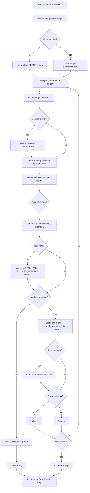

# Especificación: Clonador de Empleados SAP S/4HANA

| Campo | Valor |
|---|---|
| **Proyecto** | SAP S/4 Employee Cloner |
| **Versión spec** | 1.3.1 |
| **Estado** | Borrador — estructuras PTQUODED y TEVEN confirmadas, pendiente revisión funcional final |
| **Fecha** | 2026-06-10 |
| **Módulo SAP** | PA (Personnel Administration) + PY (Payroll) |
| **Release objetivo** | SAP S/4HANA (on-premise o Private Cloud) |
| **Estándar de código** | [Estándar LATAM S/4 v1.0](./sap-abap-estandar-latam.md) |

> **Norma de desarrollo:** Todo el código ABAP de este proyecto debe cumplir el *Estándar de Desarrollos SAP S/4 v1.0* de Grupo LATAM Airlines (PDF: `Estándar de Desarrollos SAP S_4 v1.0_17_08_2024.pdf`). Ver referencia resumida en `specs/activos/sap-abap-estandar-latam.md`.

---

## 1. Resumen ejecutivo

Se requiere una solución ABAP para **clonar la información maestra de uno o varios empleados** (números de personal origen → números de personal destino) en SAP S/4HANA, copiando **todos los infotipos estándar** de Administración de Personal, incluyendo los **infotipos de nómina localizados para Brasil (BR)** y **Colombia (CO)**, más los **infotipos Z identificados** (9000–9003: viáticos, absentismos, licencias), los **infotipos de Time Management** (2001, 2006, 2011) con sus tablas relacionadas (**PTQUODED**, **TEVEN**), y capacidad de extensión para nuevos infotipos Z.

El clonador permite **exportar los datos clonados a un archivo local** en la PC del usuario para análisis offline o respaldo, o para su posterior carga en otro ambiente SAP.

Adicionalmente, se requiere un **programa de carga/upload** que permita leer los archivos exportados desde una ruta local y cargar los datos en otro ambiente SAP, con capacidad de **reemplazar (borrar + insertar)** la información de empleados que ya existan en el sistema destino.

El clonador **no duplica datos históricos de nómina procesada** (resultados de corrida, recibos, acumulados RT, etc.), sino la **configuración maestra del empleado** necesaria para operar en PA/PY/PT: datos personales, asignaciones organizativas, datos bancarios, elementos recurrentes, datos fiscales/seguridad social localizados, gestión de tiempos, etc.

---

## 2. Objetivos

| # | Objetivo |
|---|---|
| O1 | Reducir el tiempo de creación de empleados de prueba, sandbox o migración interna |
| O2 | Garantizar consistencia entre empleado origen y destino en infotipos estándar |
| O3 | Soportar localización de nómina BR y CO sin intervención manual extensa |
| O4 | Permitir extensión configurable para infotipos Z |
| O5 | Registrar trazabilidad completa de la operación de clonación |
| O6 | Soportar múltiples empleados origen en una sola ejecución |
| O7 | Exportar datos clonados a archivo local para análisis offline o transporte entre ambientes |
| O8 | Clonar datos de Time Management (infotipos 2001, 2006, 2011) y sus tablas relacionadas |
| O9 | Cargar datos desde archivos locales a otro ambiente SAP (upload) |
| O10 | Reemplazar información existente (borrar + insertar) en ambiente destino cuando corresponda |

---

## 3. Alcance

### 3.1 Dentro del alcance

#### Programa de Clonación/Exportación (ZHR_EMPLOYEE_CLONER)

- Clonación de **uno o múltiples empleados origen** (rango o lista de PERNR).
- Clonación de infotipos PA estándar (ver catálogo sección 5).
- Clonación de infotipos de nómina localizados BR y CO (ver sección 6).
- Clonación de **infotipos de Time Management**: 2001 (Absentismos), 2006 (Ausencias con quotas), 2011 (Entradas de horario).
- Clonación de **tablas relacionadas de Time Management**:
  - **PTQUODED**: Relación entre infotipos 2001 (Absentismos) y 2006 (Gestión de quotas de ausencia).
  - **TEVEN**: Eventos de tiempo (corresponde a infotipo 2011).
- Creación del empleado destino si no existe (acción de contratación mínima).
- Copia de registros con **fechas de validez** preservadas o ajustadas según reglas configurables.
- **Exportación de datos a archivo local** (Excel/CSV) en PC del usuario.
- Modo **simulación (dry-run)** y modo **ejecución**.
- Log de operaciones, errores y advertencias.
- Configuración de infotipos Z vía tabla de customizing (9000–9003 definidos; extensible a nuevos).

#### Programa de Carga/Upload (ZHR_EMPLOYEE_UPLOAD)

- **Lectura de archivos locales** desde ruta en PC (Excel/CSV generados por el clonador).
- **Validación de integridad** de archivos y estructura de datos antes de procesar.
- **Carga de datos en ambiente SAP destino**: infotipos PA, Time Management, tablas PTQUODED y TEVEN.
- **Modo reemplazo**: si el empleado ya existe en destino, opción de:
  - Borrar todos los infotipos/tabla del empleado existente y recrear desde archivo.
  - Omitir empleados existentes (solo insertar nuevos).
  - Actualizar solo infotipos faltantes (merge).
- **Simulación previa**: validación de datos sin persistir en BD.
- **Log detallado** de operaciones de carga, errores y empleados procesados.

### 3.2 Fuera del alcance (v1)

- Clonación de **resultados de nómina** (tablas RT, BT, clusters PCL1/PCL2 de resultados).
- Clonación de **documentos adjuntos** (GOS/ArchiveLink) salvo requerimiento explícito futuro.
- Clonación entre **mandantes** diferentes.
- Clonación de usuarios SAP (SU01) vinculados al empleado.
- Sincronización bidireccional o actualización incremental.
- Clonación de **infotipos de Time Management adicionales** más allá de 2001, 2006, 2011 y sus tablas PTQUODED y TEVEN.
- Clonación de **datos procesados de CATS** (Cross-Application Time Sheet) o tablas de gestión de tiempos históricas.

---

## 4. Actores y casos de uso

### 4.1 Actores

| Actor | Rol |
|---|---|
| Consultor funcional HR/PY | Ejecuta clonaciones en QA/Sandbox |
| Desarrollador ABAP | Mantiene programa y customizing |
| Administrador de seguridad | Gestiona autorizaciones |
| Auditor | Revisa logs de clonación |

### 4.2 Casos de uso principales

```
UC-01  Clonar empleado completo (todos los infotipos en alcance)
UC-02  Clonar empleado con subconjunto de infotipos seleccionados
UC-03  Simular clonación sin persistir (dry-run)
UC-04  Clonar empleado destino ya existente (solo infotipos faltantes o sobrescribir)
UC-05  Clonar con ajuste de fechas (shift de validez)
UC-06  Re-ejecutar clonación de infotipos Z configurados
UC-07  Clonar múltiples empleados origen en batch (lista o rango de PERNR)
UC-08  Exportar datos clonados a archivo local (Excel/CSV)
UC-09  Clonar datos de Time Management (IT 2001, 2006, 2011 + PTQUODED + TEVEN)
UC-10  Cargar datos desde archivo local a ambiente SAP (upload)
UC-11  Reemplazar empleado existente (borrar + insertar desde archivo)
UC-12  Cargar solo empleados nuevos (omitir existentes)
UC-13  Simular carga sin persistir (validar datos y estructura)
UC-14  Cargar múltiples archivos (batch de archivos por empleado)
```

---

## 5. Catálogo de infotipos estándar (PA internacional)

Los infotipos listados corresponden al estándar SAP PA. La implementación debe leer el catálogo activo del sistema vía **T582A / T591A** y respetar la configuración del cliente.

### 5.1 Infotipos core (obligatorios)

| Infotipo | Descripción | Notas de clonación |
|---|---|---|
| **0000** | Acciones | Crear acción de contratación para empleado nuevo; no copiar acciones históricas del origen |
| **0001** | Asignación organizativa | Copiar registro vigente y histórico según parámetro |
| **0002** | Datos personales | Copiar; regenerar campos únicos si aplica (email, usuario) |
| **0006** | Direcciones | Copiar todos los subtipos |
| **0007** | Tiempo de trabajo planificado | Copiar |
| **0008** | Datos salariales básicos | Copiar; validar autorización |
| **0009** | Datos bancarios | Copiar; opcional enmascarar IBAN/cuenta en no-prod |
| **0014** | Pagos/descuentos recurrentes | Copiar registros vigentes e históricos |
| **0015** | Pagos adicionales | Copiar si existen |
| **0016** | Elementos de contrato | Copiar |
| **0017** | Privilegios de viaje | Copiar si aplica |
| **0021** | Familiares / dependientes | Copiar |
| **0022** | Formación | Copiar |
| **0023** | Empleos anteriores | Copiar |
| **0024** | Cualificaciones | Copiar |
| **0027** | Distribución de costes | Copiar |
| **0032** | Datos internos de personal | Copiar si está activo |
| **0033** | Estadísticas | Copiar |
| **0041** | Especificaciones de fecha | Copiar (fecha de ingreso, antigüedad, etc.) |
| **0105** | Comunicaciones | Copiar; limpiar valores únicos |
| **0185** | Documentos de identificación | Copiar; **validar unicidad** (CPF, cédula, DNI) |

### 5.2 Infotipos complementarios (estándar, incluir si activos en sistema)

| Infotipo | Descripción |
|---|---|
| 0003 | Estado nómina |
| 0004 | Desafío discapacidad |
| 0005 | Derecho a ausencias |
| 0010 | Formación de capital |
| 0011 | Transferencias externas |
| 0012 | Datos fiscales (genérico) |
| 0013 | Seguro social (genérico) |
| 0018 | Distribución de personal |
| 0019 | Monitorización de tareas |
| 0025 | Evaluaciones |
| 0026 | Especificaciones de fecha (alt.) |
| 0028 | Sanidad |
| 0034 | Datos de servicio |
| 0040 | Tipos de personal |
| 0048 | Información de residencia |
| 0049 | Datos de servicio anteriores |
| 0050 | Registro de información |
| 0057 | Membresías |
| 0081 | Datos de costes |
| 0094 | Estado de residencia |
| 0167 | Plan de salud |
| 0168 | Plan de seguro |
| 0169 | Beneficiarios |
| 0177 | Estado de residencia fiscal |
| 0208 | Datos de pago adicional |
| 0213 | Datos de tarjeta de crédito |
| 0216 | Datos de contrato adicional |
| 0233 | Datos de referencia |

> **Nota:** El programa debe consultar qué infotipos están activos para el **agrupamiento de personal** del empleado origen y replicar solo los aplicables al destino.

---

## 6. Infotipos de nómina localizados

### 6.1 Brasil (MOLGA = 37)

Infotipos típicos en implementaciones SAP HR/PY Brasil. Validar contra el sistema del cliente (transacción **PE03** / vista de infotipos por país).

| Infotipo | Descripción | Prioridad |
|---|---|---|
| **0185** | IDs: CPF, PIS/PASEP, RG, etc. | Alta — validar unicidad |
| **0002** | Datos personales (campos BR) | Alta |
| **0006** | Direcciones (formato BR) | Alta |
| **0016** | Contrato (tipo contrato CLT, etc.) | Alta |
| **0021** | Dependientes (IRRF, salario-família) | Alta |
| **0033** | Estadísticas (código municipio, etc.) | Media |
| **0094** | Estado de residencia | Media |
| **0177** | Residencia fiscal | Media |
| **0208** | Información adicional BR | Alta |
| **0216** | Datos contractuales BR | Alta |
| **0233** | Referencias bancarias BR | Media |
| **0057** | Sindicato / entidad | Media |
| **0048** | Información residencia BR | Media |

**Datos de nómina BR adicionales (tablas/vistas frecuentes):**

| Objeto | Descripción |
|---|---|
| T7BRxx | Reglas de cálculo y schemas BR |
| SEPA / eSocial | **No clonar** eventos eSocial transmitidos |
| IT0234 | Contribución sindical (si activo) |
| IT0529 | Información fiscal adicional (si activo) |
| IT0530 | Datos INSS (si activo) |
| IT0531 | Datos FGTS (si activo) |
| IT0532 | IRRF (si activo) |

> El diseño prevé tabla de configuración **ZHR_CLN_ITBR** para activar/desactivar por infotipo.
> Nota: Los infotipos 0234, 0529-0532 son infotipos de nómina BR; se incluyen si están activos en el sistema.

### 6.2 Colombia (MOLGA = 38)

| Infotipo | Descripción | Prioridad |
|---|---|---|
| **0185** | Cédula de ciudadanía, NIT, etc. | Alta — validar unicidad |
| **0002** | Datos personales CO | Alta |
| **0006** | Direcciones CO | Alta |
| **0016** | Contrato (tipo contrato laboral CO) | Alta |
| **0021** | Dependientes | Alta |
| **0033** | Estadísticas (código ciudad DANE, etc.) | Alta |
| **0094** | Estado de residencia | Media |
| **0177** | Residencia fiscal | Media |
| **0208** | Información adicional CO | Alta |
| **0216** | Datos contractuales CO | Alta |
| **0233** | Referencias / datos bancarios CO | Media |
| **0377** | Seguridad social Colombia (EPS, AFP, ARL, cajas) | Alta |
| **0378** | Retención en la fuente | Alta |
| **0379** | Provisiones prestaciones sociales | Alta |

> El diseño prevé tabla de configuración **ZHR_CLN_ITCO** análoga a BR.

**Datos de nómina CO adicionales (validar en cliente):**

| Infotipo / Objeto | Descripción |
|---|---|
| IT0380 | Novedades de nómina |
| IT0381 | Datos de pago PILA |
| T7COxx | Schemas y reglas CO |

> Confirmar numeración exacta en **PE03** para MOLGA 38.

---

## 6.3 Time Management (PT) — Infotipos y tablas adicionales

Además de los infotipos PA estándar, se requiere clonar los siguientes infotipos y tablas de Time Management:

### Infotipos Time Management

| Infotipo | Descripción | Prioridad | Notas de clonación |
|---|---|---|---|
| **2001** | Absentismos | Alta | Copiar registros de ausencias/absentismos |
| **2006** | Ausencias con quotas de ausencia | Alta | Relacionado con 2001 vía PTQUODED |
| **2011** | Entradas de horario | Alta | Relacionado con tabla TEVEN |

### Tablas de Time Management (no infotipos)

| Tabla | Descripción | Relación | Prioridad | Notas de clonación |
|---|---|---|---|---|
| **PTQUODED** | Relación entre absentismos y quotas | IT 2001 ↔ IT 2006 | Alta | Copiar registros que relacionan absentismos con quotas de ausencia |
| **TEVEN** | Eventos de tiempo | IT 2011 | Alta | Copiar eventos de tiempo correspondientes a registros del infotipo 2011 |

### Consideraciones específicas Time Management

1. **PTQUODED**: Esta tabla almacena la relación entre registros del infotipo 2001 (Absentismos) y el infotipo 2006 (Gestión de quotas). Al clonar, se debe:
   - Leer todos los registros de PTQUODED para el PERNR origen
   - Relacionar los registros 2001 y 2006 clonados
   - Generar nuevos registros en PTQUODED para el PERNR destino
   - Preservar la relación entre absentismo y quota

2. **TEVEN**: Tabla de eventos de tiempo (Time Events). Al clonar:
   - Leer registros TEVEN relacionados con IT 2011
   - Copiar solo datos maestros/configuración, no eventos históricos procesados por CATS
   - Validar fechas de validez consistentes con IT 2011

3. **Validaciones**:
   - Verificar que el subtipo de ausencia (AWART) exista en el sistema destino
   - Validar que las quotas de ausencia tengan saldo disponible si se requiere
   - No copiar registros con fechas fuera del período de validez del empleado destino

---

### 6.4 Resto de países

Para empleados cuyo **agrupamiento de personal** no sea BR ni CO, se clonan únicamente los **infotipos estándar internacionales** de la sección 5, sin infotipos de localización específicos.

---

## 7. Infotipos Z (definidos por archivo de estructura)

### 7.1 Infotipos Z identificados (del archivo `estructura_infotipos.xls`)

| Infotipo | Estructura | Descripción | Prioridad | Notas de clonación |
|---|---|---|---|---|
| **9000** | P9000 | Viáticos y traslados | Media | Importes de viático, traslado, otros. Campos: `EVENTO`, `IMP_VIATICO`, `MON_VIATICO`, `IMP_TRASLADO`, `MON_TRASLADO`, `IND_PRECONT`, `SOCIEDAD` |
| **9001** | P9001 | Novedades de absentismos | Alta | Clonado completo con CC-nómina (LGA01-LGA14). Incluye días, valores, subvenciones. Campos clave: `MTMOD`, `CASNO`, `NRDAY`, `AWART`, `VADIA`, `VASUB`, `WAERS`, `LGA01-LGA14`, `NRDAB`, `NRDPG`, `TRIBU` |
| **9002** | P9002 | Licencias | Media | Control de estados de licencia. Campos: `STATUS`, `DTINIC`, `ABONO`, `FERIAS`, `NDIASFE`, `SALDO`, `OPFERIAS`, `USERIDR`, `DATER`, `DESC_STATUS` |
| **9003** | P9003 | Datos de licencias/categorías | Media | Categorías y tipos de licencia. Campos: `NLICE`, `ZCAT1`, `ZTLI1`, `ZCLA1` hasta `ZCAT5`, `ZTLI5`, `ZCLA5`, `ZOTOR`, `ZCA01` |

> **Nota:** El diseño prevé que nuevos infotipos Z puedan agregarse vía tabla de customizing sin modificar código core.

### 7.2 Campos técnicos a excluir en todos los infotipos Z

Siguiendo el estándar de infotipos SAP:
- `PERNR` → regenerar en destino
- `AEDTM`, `UNAME` → regenerar en destino
- `SEQNR` → asignar nuevo por time constraint

### 7.3 Tabla de configuración: `ZHR_CLN_ITZ`

| Campo | Tipo | Descripción |
|---|---|---|
| MANDT | CLNT | Mandante |
| ITYPE | NUMC(4) | Número de infotipo Z |
| ACTIVE | XFELD | Activo |
| COPY_HIST | XFELD | Copiar histórico completo |
| COPY_CURR | XFELD | Copiar registro vigente |
| SUBTY_FILTER | CHAR(4) | Subtipo (opcional, blanco = todos) |
| EXCLUDE_FIELDS | STRING | Lista campos a excluir (separados por `;`) |
| POST_PROCESS | CHAR(30) | BAdI/método post-proceso (opcional) |
| REMARKS | CHAR(255) | Descripción |

### 7.4 Reglas específicas por infotipo Z

| Infotipo | Regla especial |
|---|---|
| 9000 | Validar que `SOCIEDAD` (BUKRS) exista en destino; ajustar monedas según país destino |
| 9001 | Recalcular `NRDAB` (días absentismos) y `NRDPG` (días pagados) según calendario destino si aplica |
| 9002 | Limpiar campos de usuario (`USERIDR`, `DATER`, `USERIDA`, `DATEA`) para regeneración |
| 9003 | Validar existencia de categorías/tipos de licencia (`ZCAT*`, `ZTLI*`) en sistema destino |

---

## 8. Reglas de negocio

### 8.1 Reglas generales

| ID | Regla |
|---|---|
| RN-01 | El empleado **origen** debe existir y estar activo o en baja; no clonar desde empleado inexistente |
| RN-02 | El empleado **destino** se crea con acción **01-Contratación** si no existe |
| RN-03 | Campos con **unicidad global** (CPF, cédula, email, usuario SAP) deben parametrizarse: `COPIAR`, `LIMPIAR`, `GENERAR_DUMMY` |
| RN-04 | Los infotipos se procesan en **orden de dependencia** (0000 → 0001 → 0002 → …) |
| RN-05 | Respetar **time constraints** (T591A/T591B); si hay solapamiento, decidir según modo: `ERROR`, `SOBRESCRIBIR`, `AJUSTAR_FECHA` |
| RN-06 | No copiar campos técnicos: `PERNR`, `AEDTM`, `UNAME`, `REPID`, `SEQNR` (regenerar en destino) |
| RN-07 | El **agrupamiento de personal** del destino debe ser compatible; si difiere, solo clonar infotipos válidos para el agrupamiento destino |
| RN-08 | Operación debe ser **commit explícito** solo al final si no hay errores críticos |

### 8.2 Reglas por país

| ID | Regla |
|---|---|
| RN-BR-01 | CPF y PIS deben ser únicos; en sandbox usar prefijo configurable (ej. `999...`) |
| RN-BR-02 | No clonar datos eSocial ya transmitidos |
| RN-CO-01 | Cédula y NIT deben ser únicos |
| RN-CO-02 | Validar códigos DANE, EPS, AFP, ARL contra tablas T7CO* |

### 8.3 Parámetros de selección (pantalla inicial)

#### Selección de empleados origen

| Parámetro | Tipo | Obligatorio | Descripción |
|---|---|---|---|
| S_PERNR_SRC | PERNR | Sí (uno al menos) | Rango de números personal origen (permite múltiples) |
| P_SRC_FILE | CHAR(255) | No | Ruta archivo de entrada con lista de PERNR (alternativa a rango) |

#### Selección de empleados destino

| Parámetro | Tipo | Obligatorio | Descripción |
|---|---|---|---|
| P_MODE_TGT | CHAR(1) | Sí | Modo destino: 'A' = Auto (nuevo PERNR por cada origen), 'M' = Manual (especificar), 'F' = Archivo |
| S_PERNR_TGT | PERNR | No (si modo Auto) | Rango de números personal destino (modo Manual) |
| P_TGT_FILE | CHAR(255) | No (si modo Manual) | Ruta archivo con mapeo origen→destino (modo Archivo) |
| P_BUKRS | BUKRS | No | Sociedad para nuevos empleados |
| P_WERKS | PERSA | No | División personal para nuevos empleados |
| P_BTRTL | BTRTL | No | Subdivisión personal para nuevos empleados |

#### Opciones de clonación

| Parámetro | Tipo | Obligatorio | Descripción |
|---|---|---|---|
| P_COPY_HIST | XFELD | No | Copiar histórico completo |
| P_SIMUL | XFELD | No | Modo simulación |
| P_OVERWRITE | XFELD | No | Sobrescribir infotipos existentes en destino |
| P_DATE_SHIFT | INT4 | No | Desplazar fechas N días |
| P_ITYPE_FROM | ITYPE | No | Rango infotipos desde |
| P_ITYPE_TO | ITYPE | No | Rango infotipos hasta |
| P_COUNTRY | LAND1 | No | Filtrar localización (BR/CO/blanco=todos) |
| P_INCL_PT | XFELD | No | Incluir Time Management (IT 2001, 2006, 2011 + PTQUODED + TEVEN) |

#### Exportación a archivo local

| Parámetro | Tipo | Obligatorio | Descripción |
|---|---|---|---|
| P_EXP_LOCAL | XFELD | No | Exportar datos clonados a archivo local |
| P_EXP_PATH | CHAR(255) | No (sí si P_EXP_LOCAL = X) | Ruta local para guardar archivo (PC usuario) |
| P_EXP_FORMAT | CHAR(4) | No | Formato: 'XLSX', 'CSV', 'JSON' (default: XLSX) |
| P_EXP_SPLIT | XFELD | No | Generar archivo separado por empleado |

> **Notas sobre exportación local:**
> - Usar `CL_GUI_FRONTEND_SERVICES` para acceso al filesystem local
> - Formato Excel: Usar `CL_XLSX_DOCUMENT` o `CL_SALV_BS_OFFICE` para generar .xlsx
> - Formato CSV: Generar archivo de texto con separadores
> - La exportación ocurre antes o después de la persistencia según modo simulación
> - En modo simulación, solo se exporta (no se persiste en SAP)

---

## 9. Arquitectura técnica

### 9.1 Componentes ABAP propuestos

```
┌─────────────────────────────────────────────────────────────┐
│ PROGRAMA 1: ZHR_EMPLOYEE_CLONER (Transacción ZHR_CLONE)      │
├─────────────────────────────────────────────────────────────┤
│  ZCL_HR_CLN_ORCHESTRATOR   — Coordinador principal          │
│  ZCL_HR_CLN_BATCH_MGR      — Gestor de procesamiento batch  │
│  ZCL_HR_CLN_ITYPE_FACTORY  — Factory por infotipo           │
│  ZCL_HR_CLN_ITYPE_BASE     — Clase abstracta infotipo       │
│  ZCL_HR_CLN_ITYPE_0002     — Implementación por infotipo    │
│  ZCL_HR_CLN_ITYPE_0008     — ...                            │
│  ZCL_HR_CLN_ITYPE_2001     — Handler Time Management 2001   │
│  ZCL_HR_CLN_ITYPE_2006     — Handler Time Management 2006   │
│  ZCL_HR_CLN_ITYPE_2011     — Handler Time Management 2011   │
│  ZCL_HR_CLN_PTQUODED     — Handler tabla PTQUODED         │
│  ZCL_HR_CLN_TEVEN          — Handler tabla TEVEN            │
│  ZCL_HR_CLN_LOC_BR         — Handler localización BR        │
│  ZCL_HR_CLN_LOC_CO         — Handler localización CO        │
│  ZCL_HR_CLN_LOC_INTL       — Handler estándar internacional │
│  ZCL_HR_CLN_EXPORTER       — Exportador a archivo local     │
│  ZCL_HR_CLN_LOGGER         — Log estructurado               │
│  ZCL_HR_CLN_VALIDATOR      — Validaciones pre/post          │
│  ZIF_HR_CLN_BADI           — BAdI extensibilidad cliente    │
└─────────────────────────────────────────────────────────────┘

┌─────────────────────────────────────────────────────────────┐
│ PROGRAMA 2: ZHR_EMPLOYEE_UPLOAD (Transacción ZHR_UPLOAD)    │
├─────────────────────────────────────────────────────────────┤
│  ZCL_HR_UPL_ORCHESTRATOR   — Coordinador carga principal    │
│  ZCL_HR_UPL_FILE_READER    — Lector archivos Excel/CSV      │
│  ZCL_HR_UPL_PARSER         — Parser y validación estructura  │
│  ZCL_HR_UPL_ITYPE_LOADER   — Cargador por infotipo          │
│  ZCL_HR_UPL_PT_LOADER      — Cargador PTQUODED             │
│  ZCL_HR_UPL_TEVEN_LOADER   — Cargador TEVEN                 │
│  ZCL_HR_UPL_REPLACER       — Lógica borrar+insertar (replace)│
│  ZCL_HR_UPL_EXISTENCE_CHK  — Verificador empleados existentes│
│  ZCL_HR_UPL_IMPORTER       — Importador desde archivo       │
│  ZCL_HR_UPL_LOGGER         — Log estructurado de carga      │
│  ZCL_HR_UPL_VALIDATOR      — Validaciones pre-carga         │
│  ZIF_HR_UPL_BADI           — BAdI extensibilidad carga      │
└─────────────────────────────────────────────────────────────┘
```

### 9.2 APIs SAP a utilizar

#### Infotipos PA y Time Management

| API / FM | Uso |
|---|---|
| `HR_INFOTYPE_OPERATION` | Crear/modificar infotipos (modo clásico) |
| `BAPI_EMPLCOMMIT` / `BAPI_TRANSACTION_COMMIT` | Commit de datos PA |
| `BAPI_EMPLOYEE_GETDATA` | Lectura empleado (si disponible para infotipo) |
| `RH_READ_INFOTYPE` / `HR_READ_INFOTYPE` | Lectura infotipos origen |
| `HR_PERS_DATA` | Datos personales |
| `PA_*` macros / includes estándar | Según infotipo |
| `BAdI `HR_INFOTYPE_UPDATE` / custom | Validaciones cliente |
| `HR_ABSENCE_GETDETAIL` | Lectura detalle de ausencias (IT 2001) |
| `HR_QUOTA_GETDETAIL` | Lectura detalle de quotas (IT 2006) |
| `HR_TIME_EVENT_GET` | Lectura eventos de tiempo (IT 2011) |

#### Tablas Time Management

| Tabla / Función | Uso |
|---|---|
| `PTQUODED` | Lectura/escritura relación absentismos-quotas |
| `TEVEN` | Lectura/escritura eventos de tiempo |
| `CL_HRPAD_QUOTA_DEDUCTION` | Gestión de deducciones de quota (alternativa a tabla directa) |

#### Exportación a archivo local

| Clase / FM | Uso |
|---|---|
| `CL_GUI_FRONTEND_SERVICES` | Acceso al filesystem local (selección de ruta) |
| `CL_GUI_FRONTEND_SERVICES=>GUI_DOWNLOAD` | Descarga de archivo a PC local |
| `CL_XLSX_DOCUMENT` | Generación de archivos Excel (.xlsx) |
| `CL_SALV_BS_OFFICE` | Exportación ALV a Excel/Word |
| `CL_ABAP_CONV_OUT_CE` | Conversión a formatos de salida (CSV, JSON) |

> **Preferencia S/4HANA:** Evaluar uso de **APIs OData HCM** (`API_WORKFORCE_PERSON`, `API_WORKER`) para infotipos soportados; mantener fallback ABAP clásico para infotipos no expuestos vía API.

### 9.3 Flujo de procesamiento

#### Proceso principal (múltiples empleados)



### 9.4 Estrategia de lectura/escritura por infotipo

Para cada infotipo en la cola:

1. **Leer** todos los registros del origen (`HR_READ_INFOTYPE` o SELECT directo a tabla PA* con autorización).
2. **Transformar**: limpiar PERNR, aplicar reglas de campos únicos, shift de fechas.
3. **Validar**: time constraints, existencia de subtipos, valores contra customizing.
4. **Escribir**: `HR_INFOTYPE_OPERATION` operación `INS` o `MOD` según overwrite.
5. **Registrar** resultado en log (éxito/advertencia/error).

### 9.5 Estrategia Time Management (PTQUODED y TEVEN)

#### PTQUODED (Relación IT 2001 ↔ IT 2006) - Estructura Completa

**Nombre tabla:** `PTQUODED` (sin guión bajo)

**Clave primaria:** MANDT + QUONR + DOCNR

```
Proceso:
1. Leer todos los registros de PTQUODED para PERNR origen
2. Para cada registro PTQUODED:
   a. Obtener DOCNR (número de documento) del IT 2001 relacionado
   b. Obtener QUONR (número contingente) del IT 2006 relacionado
   c. Clonar IT 2001 → obtener nuevos valores en destino
   d. Clonar IT 2006 → obtener nuevos valores en destino
   e. Crear registro PTQUODED con nuevos valores y PERNR destino
3. Validar consistencia de fechas entre absentismo y quota
4. Verificar que la quota tenga suficiente saldo en destino (si aplica)
```

| Campo PTQUODED | Tipo | Descripción | Regla clonación |
|---|---|---|---|
| `MANDT` | CLNT 3 | Mandante | Mantener mandante destino |
| `QUONR` | NUMC 20 | Número contingente tiempos personales | **GENERAR NUEVO** si es necesario, o copiar si la quota ya existe en destino |
| `DOCNR` | NUMC 20 | Número comprobante datos tiempos | **GENERAR NUEVO** en destino (referencia al documento de ausencia) |
| `DATUM` | DATS 8 | Fecha | Copiar o aplicar shift de fechas |
| `PERNR` | NUMC 8 | Número de personal | Reemplazar por PERNR destino |
| `QUODE` | DEC 10,5 | Liquidación contingente tiempos personales | Copiar valor calculado |
| `QUOUN` | CHAR 3 | Unidad contingente tiempos personales | Copiar (horas, días, etc.) |

##### Consideraciones especiales PTQUODED

1. **QUONR + DOCNR (Clave primaria):**
   - Estos campos forman la clave primaria junto con MANDT
   - En clonación: Pueden reutilizarse si la quota de ausencia (IT 2006) se crea con el mismo número
   - En upload: Validar que no exista ya la combinación MANDT+QUONR+DOCNR

2. **Relación con IT 2001 (Absentismos):**
   - `DOCNR` en PTQUODED corresponde al identificador del registro de absentismo (IT 2001)
   - Al clonar IT 2001, se genera un nuevo documento en destino
   - El `DOCNR` en PTQUODED debe actualizarse con el nuevo valor generado

3. **Relación con IT 2006 (Quotas de Ausencia):**
   - `QUONR` en PTQUODED es el número del contingente/quota (IT 2006)
   - Si se clona IT 2006, se preserva o genera nuevo QUONR
   - El `QUONR` en PTQUODED debe corresponder al nuevo valor en destino

4. **DATUM (Fecha):**
   - Fecha de la deducción/liquidación de la quota
   - Debe estar dentro del rango de validez del IT 2001 en destino

5. **Proceso de mapeo en clonación/upload:**
   ```
   Orden correcto de procesamiento:
   1. Clonar IT 2006 primero → obtener nuevos QUONR destino
   2. Clonar IT 2001 → obtener nuevos DOCNR destino  
   3. Para cada PTQUODED origen:
      a. Buscar QUONR origen → mapear a QUONR destino (de IT 2006 clonado)
      b. Buscar DOCNR origen → mapear a DOCNR destino (de IT 2001 clonado)
      c. Crear PTQUODED destino con valores mapeados
   ```

6. **Validaciones:**
   - Verificar que el tipo de quota (KTART en IT 2006) exista en destino
   - Validar que haya suficiente saldo de quota para la deducción (QUODE)
   - Comprobar que la fecha (DATUM) esté dentro del período de validez del empleado

#### TEVEN (Eventos de tiempo) - Estructura Completa

**Clave primaria:** MANDT + PDSNR + PERNR

```
Proceso:
1. Leer registros TEVEN para PERNR origen relacionados con IT 2011
2. Validar que los eventos no sean históricos procesados por CATS
3. Para cada registro TEVEN:
   a. Generar nuevo PDSNR (número consecutivo) en destino
   b. Clonar con nuevo PERNR y nuevo PDSNR
   c. Limpiar campos técnicos (ERDAT, ERTIM, UNAME, AEDTM)
   d. Validar existencia de SATZA (clase hecho temporal) en destino
   e. Validar existencia de ABWGR (motivo) en destino si aplica
4. Insertar en tabla TEVEN para PERNR destino
```

| Campo TEVEN | Tipo | Descripción | Regla clonación/carga |
|---|---|---|---|
| `MANDT` | CLNT | Mandante | Mantener mandante destino |
| `PDSNR` | NUMC 12 | Número consecutivo notificación CDP | **GENERAR NUEVO** en destino (secuencial por PERNR) |
| `PERNR` | NUMC 8 | Número de personal | Reemplazar por PERNR destino |
| `LDATE` | DATS 8 | Fecha lógica | Copiar o aplicar shift de fechas |
| `LTIME` | TIMS 6 | Hora lógica | Copiar |
| `ERDAT` | DATS 8 | Fecha entrada | **LIMPIAR** (regenerar en destino) |
| `ERTIM` | TIMS 6 | Hora entrada | **LIMPIAR** (regenerar en destino) |
| `SATZA` | CHAR 3 | Clase hecho temporal | Validar existencia en customizing destino |
| `TERID` | CHAR 4 | ID Terminal | Copiar |
| `ABWGR` | CHAR 4 | Motivo presencia/ausencia | Validar existencia si no es vacío |
| `EXLGA` | CHAR 4 | Gastos empleados | Copiar si aplica |
| `ZEINH` | CHAR 3 | Unidad de tiempo/medida | Copiar |
| `HRAZL` | DEC 7,2 | Cantidad | Copiar |
| `HRBET` | CURR 9,2 | Importe para recibo de salarios | Copiar |
| `ORIGF` | CHAR 1 | Indicador origen mensaje CDP | Copiar |
| `DALLF` | CHAR 1 | Asignación de día | Copiar |
| `PDC_OTYPE` | CHAR 2 | Tipo objeto | Copiar |
| `PDC_PLANS` | NUMC 8 | Posición | Copiar (validar existencia si aplica) |
| `OTYPE` | CHAR 2 | Tipo objeto | Copiar |
| `PLANS` | NUMC 8 | Posición | Copiar (validar existencia si aplica) |
| `PDC_USRUP` | CHAR 20 | Campo cliente libre | Copiar si tiene valor |
| `USER2` | CHAR 40 | Campo cliente libre | Copiar si tiene valor |
| `UNAME` | CHAR 12 | Nombre de usuario | **LIMPIAR** (usuario actual en destino) |
| `AEDTM` | DATS 8 | Fecha de modificación | **LIMPIAR** (fecha actual en destino) |
| `STOKZ` | CHAR 1 | Indicador: Notificación anulada | Copiar (si anulado, copiar estado) |
| `REFEX` | CHAR 1 | Existencia campos referencia | Copiar |
| `ORDEX` | CHAR 1 | Existencia campos notificación | Copiar |
| `RUECK` | NUMC 10 | Número notificación operación | **Omitir** (es específico del origen) |
| `SPLIT` | INT1 3 | Entero sin signo 1 byte | Copiar |
| `KAPAR` | CHAR 3 | Campo 3 bytes | Copiar |
| `ABWEX` | CHAR 1 | Campos paga diferente completos | Copiar |
| `TRFGR` | CHAR 8 | Grupo profesional | Copiar (validar contra destino) |
| `TRFST` | CHAR 2 | Subgrupo profesional | Copiar (validar contra destino) |
| `PRAKN` | CHAR 2 | Número de prima | Copiar |
| `PRAKZ` | NUMC 4 | Indicador de prima | Copiar |
| `AUFKZ` | CHAR 1 | Indicador prima | Copiar |
| `BWGRL` | CURR 13,2 | Base valoración paga diferente | Copiar |
| `WAERS` | CUKY 5 | Clave de moneda | Copiar (validar existencia) |
| `ZAUSW` | NUMC 8 | Número tarjeta identificación tiempos | **VALIDAR UNICIDAD** o generar nuevo |

##### Campos de inclusión (INCLUDE PDEVE)
Estos campos están dentro de la estructura .INCLUDE PDEVE y deben procesarse igual que los campos principales.

##### Consideraciones especiales TEVEN

1. **PDSNR (Número consecutivo):** Es parte de la clave primaria. No puede duplicarse por PERNR.
   - En clonación: Generar nuevo número secuencial para PERNR destino
   - En upload: Validar que no exista ya para ese PERNR+MANDT

2. **ZAUSW (Tarjeta de identificación de tiempos):** Campo sensible de unicidad.
   - Validar que no exista en otro PERNR en destino
   - Si existe, generar nuevo o limpiar según configuración

3. **RUECK (Número notificación operación):** Referencia a notificaciones CO/PP.
   - No copiar (es específico del sistema origen)
   - Limpiar o dejar en blanco

4. **Campos de auditoría (ERDAT, ERTIM, UNAME, AEDTM):**
   - Siempre regenerar en sistema destino
   - No copiar valores del origen

### 9.6 Estrategia de exportación a archivo local

#### Formato Excel (.xlsx)

```
Proceso:
1. Agrupar datos por empleado y tipo (infotipo PA, Time Management, Z)
2. Crear hojas separadas por categoría:
   - "PA_Core": Infotipos 0000-0100
   - "PA_Adic": Infotipos 0105-0233
   - "Time_Mgmt": IT 2001, 2006, 2011
   - "Time_Tablas": PTQUODED, TEVEN
   - "Localizacion_BR": Infotipos BR
   - "Localizacion_CO": Infotipos CO
   - "Infotipos_Z": IT 9000-9003
   - "Log": Resultados de la operación
3. Generar archivo usando CL_XLSX_DOCUMENT
4. Descargar a PC via CL_GUI_FRONTEND_SERVICES=>GUI_DOWNLOAD
```

#### Formato CSV

```
Proceso:
1. Generar archivo por infotipo/tabla
2. Incluir headers con nombres de campos
3. Formato: UTF-8, separador ; (punto y coma)
4. Manejar campos numéricos con decimales según locale
```

#### Opciones de exportación

| Opción | Comportamiento |
|---|---|
| Archivo único | Todos los empleados en un solo archivo, hojas separadas por empleado o tipo |
| Archivo separado por empleado | Un archivo por cada PERNR procesado |
| Solo simulación | Exportar sin persistir en SAP (solo lectura y generación de archivo) |
| Post-clonación | Exportar después de clonar (para respaldo/verificación) |

### 9.7 Programa de Carga/Upload (ZHR_EMPLOYEE_UPLOAD)

#### Componentes específicos

```
ZCL_HR_UPL_ORCHESTRATOR    — Controlador principal de carga
ZCL_HR_UPL_FILE_READER     — Lector archivos Excel/CSV desde PC
ZCL_HR_UPL_PARSER            — Parser y validador de estructura
ZCL_HR_UPL_ITYPE_LOADER    — Cargador genérico de infotipos
ZCL_HR_UPL_PT_LOADER       — Cargador tabla PTQUODED
ZCL_HR_UPL_TEVEN_LOADER    — Cargador tabla TEVEN
ZCL_HR_UPL_REPLACER        — Gestor modo REEMPLAZAR (delete+insert)
ZCL_HR_UPL_EXISTENCE_CHK   — Verificador existencia empleados
ZCL_HR_UPL_LOGGER          — Logger específico de upload
ZIF_HR_UPL_BADI            — Interfaz extensibilidad upload
```

#### Parámetros de selección (ZHR_UPLOAD)

| Parámetro | Tipo | Obligatorio | Descripción |
|---|---|---|---|
| P_PATH | CHAR(255) | Sí | Ruta completa archivo en PC local |
| P_FORMAT | CHAR(4) | No | Formato: 'XLSX', 'CSV' (default XLSX) |
| P_MODE | CHAR(1) | No | Modo: 'N'=Nuevos, 'R'=Reemplazar, 'M'=Merge (default R) |
| P_SIMUL | XFELD | No | Simulación sin persistir (default X) |
| P_DEL_TM | XFELD | No | Borrar también tablas TM (PTQUODED, TEVEN) en modo Reemplazar |
| P_COMMIT_SIZE | NUMC(3) | No | Cantidad empleados por COMMIT (default 10) |
| P_STOP_ON_ERR | XFELD | No | Detener todo el proceso si un empleado falla (default '') |

#### Modos de operación

| Modo | Código | Descripción | Comportamiento empleado existente |
|---|---|---|---|
| NUEVOS | N | Solo insertar nuevos | Error: omitir empleado |
| REEMPLAZAR | R | Borrar todo + Insertar | Borrar todos IT + PTQUODED + TEVEN, luego insertar |
| MERGE | M | Fusión | Insertar solo IT que no existan (por tipo+subtipo+fecha) |

#### Proceso de reemplazo detallado

```
Para cada empleado en archivo:
    1. Verificar PERNR existe en sistema
    2. Leer todos los infotipos activos del empleado
    3. Ordenar por dependencia inversa (para borrar sin violar constraints)
    4. Para cada infotipo:
       - HR_INFOTYPE_OPERATION con operación 'DEL'
       - Si time constraint 1: usar 'LIS9' (delimitar) o 'DEL' según config
    5. Borrar PTQUODED: DELETE FROM pt_quoded WHERE pernr = [pernr]
    6. Borrar TEVEN: DELETE FROM teven WHERE pernr = [pernr]
    7. Verificar empleado "limpio":
       - Solo debe quedar IT 0000 (acción mínima) o IT 0001 (asignación)
       - Si quedan otros IT: advertencia pero continuar
    8. Insertar nuevos infotipos desde archivo en orden correcto:
       - 0000 → 0001 → 0002 → ... → 2001/2006 → 2011
    9. Recalcular SEQNR para IT 2001 y 2006
    10. Insertar PTQUODED con nuevos SEQNR mapeados
    11. Insertar TEVEN con PERNR correcto
    12. COMMIT WORK o acumular para batch commit
```

#### APIs SAP para upload

| API / FM | Uso |
|---|---|
| `CL_GUI_FRONTEND_SERVICES=>GUI_UPLOAD` | Leer archivo desde PC |
| `CL_XLSX_DOCUMENT` | Parsear Excel .xlsx |
| `HR_INFOTYPE_OPERATION` (DEL) | Borrar infotipos existentes |
| `HR_INFOTYPE_OPERATION` (INS) | Insertar nuevos infotipos |
| `BAPI_EMPLOYEE_GETDATA` | Verificar existencia empleado |
| `BAPI_TRANSACTION_COMMIT` / `COMMIT WORK` | Persistir cambios |
| `DELETE FROM` (PTQUODED, TEVEN) | Borrar tablas TM |
| `INSERT INTO` (PTQUODED, TEVEN) | Insertar tablas TM |

#### Estructura archivo Excel de entrada

| Hoja | Descripción | Campos requeridos |
|---|---|---|
| METADATA | Info exportación | VERSION, EXPORT_DATE, SOURCE_SYSTEM |
| EMPLEADOS | Índice empleados | PERNR, EXIST_ACTION (NUEVO/REEMPLAZAR) |
| IT_0000 | Acciones | PERNR, BEGDA, ENDDA, MASSN, MASSG |
| IT_0001 | Asignación org | PERNR, BEGDA, ENDDA, BUKRS, WERKS, PERSG... |
| ... | ... | ... |
| IT_2001 | Absentismos | PERNR, BEGDA, ENDDA, SUBTY, AWART... |
| IT_2006 | Quotas | PERNR, BEGDA, ENDDA, KTART... |
| PTQUODED | Relación 2001-2006 | PERNR, ABSNR_OLD, QUONR_OLD, BEGDA, ENDDA |
| TEVEN | Eventos tiempo | PERNR, LDATE, LTIME, SATZA... |

> **Nota**: Los campos `ABSNR_OLD` y `QUONR_OLD` en PTQUODED son los SEQNR originales; el programa debe recalcular y mapear los nuevos SEQNR al insertar IT 2001 e IT 2006.

#### Consideraciones de seguridad

- Objeto autorización `ZHR_UPL` con actividades: 01=Cargar, 02=Simular, 03=Reemplazar
- Validar ruta local: no permitir rutas de red (\serverile) sin autorización explícita
- Tamaño máximo archivo: parámetro configurable (default 50MB)
- Encoding UTF-8 obligatorio para CSV
- Log detallado de operaciones de borrado para auditoría

### 9.8 BAdI de extensibilidad

#### Clonador: `ZIF_HR_CLN_BADI`

| Método | Propósito |
|---|---|
| `ADJUST_SOURCE_BEFORE_COPY` | Modificar registro origen antes de copiar |
| `ADJUST_TARGET_BEFORE_SAVE` | Modificar registro destino antes de grabar |
| `SKIP_INFOTYPE` | Lógica custom para omitir infotipo |
| `AFTER_INFOTYPE_COPY` | Post-proceso por infotipo |
| `AFTER_CLONE_COMPLETE` | Notificaciones, workflow, etc. |

#### Upload: `ZIF_HR_UPL_BADI`

| Método | Propósito |
|---|---|
| `VALIDATE_FILE_BEFORE_READ` | Validaciones custom del archivo antes de parsear |
| `ADJUST_RECORD_BEFORE_INSERT` | Modificar registro antes de insertar en BD |
| `SKIP_RECORD` | Condiciones custom para omitir registro específico |
| `AFTER_EMPLOYEE_UPLOAD` | Post-proceso después de cargar empleado |
| `HANDLE_ERROR` | Lógica custom de manejo de errores |

---

## 10. Modelo de datos de configuración

### 10.1 Tabla maestra: `ZHR_CLN_CONFIG`

| Campo | Descripción |
|---|---|
| UNIQ_CPF_MODE | Modo unicidad CPF: C/L/G (Copiar/Limpiar/Generar) |
| UNIQ_CED_MODE | Modo unicidad cédula CO |
| UNIQ_EMAIL_MODE | Modo email |
| DUMMY_PREFIX | Prefijo para IDs dummy en sandbox |
| DEFAULT_BUKRS | Sociedad default nuevo empleado |
| MAX_HIST_MONTHS | Límite meses de histórico a copiar (0 = todo) |
| LOG_OBJECT | Objeto application log |

### 10.2 Tabla de log: `ZHR_CLN_LOG`

| Campo | Descripción |
|---|---|
| CLONE_ID | UUID operación |
| PERNR_SRC / PERNR_TGT | Origen / destino |
| ITYPE | Infotipo procesado |
| SUBTY | Subtipo |
| BEGDA / ENDDA | Validez |
| STATUS | S/W/E (Success/Warning/Error) |
| MESSAGE | Texto |
| UNAME / DATUM / UZEIT | Auditoría |

---

## 11. Seguridad y autorizaciones

### 11.1 Objeto de autorización propuesto

| Objeto | Campo | Valor |
|---|---|---|
| `P_PERNR` | `PERNR` | Empleado origen y destino |
| `P_ORGIN` | `INFTY` | Infotipos permitidos |
| `P_ORGXX` | `WERKS`, `BTRTL` | Agrupamiento personal |
| `ZHR_CLN` | `ACTVT` | 01=Simular, 02=Ejecutar, 03=Configurar |

### 11.2 Roles propuestos

| Rol | Permisos |
|---|---|
| `ZHR_CLN_DISPLAY` | Simulación y consulta de logs |
| `ZHR_CLN_EXECUTE` | Ejecución en sandbox/QA |
| `ZHR_CLN_ADMIN` | Configuración + ejecución en PRD (restringido) |

### 11.3 Consideraciones

- En producción, restringir a personal autorizado de HR.
- Enmascarar datos sensibles (cuentas bancarias, IDs) en logs.
- Registrar usuario, fecha/hora y mandante de cada clonación.

---

## 12. Manejo de errores

| Código | Severidad | Descripción | Acción |
|---|---|---|---|
| E001 | Error | Empleado origen no existe | Abortar |
| E002 | Error | Sin autorización infotipo | Abortar infotipo |
| E003 | Error | Violación time constraint | Según parámetro OVERWRITE |
| E004 | Error | Campo único duplicado | Abortar infotipo |
| E005 | Error | BAPI commit fallido | Rollback total |
| W001 | Warning | Infotipo no activo en destino | Omitir, continuar |
| W002 | Warning | Subtipo no válido en destino | Omitir registro |
| W003 | Warning | Campo limpiado por unicidad | Continuar, loguear |
| S001 | Success | Infotipo copiado correctamente | — |

---

## 13. Interfaz de usuario

### 13.1 Transacción: `ZHR_CLONE`

- Pantalla de selección con parámetros de sección 8.3.
- Botones: **Ejecutar**, **Simular**, **Log histórico**.
- ALV de resultados al finalizar con semáforo (verde/amarillo/rojo).
- Exportación a Excel del log.

### 13.2 Transacción de customizing: `ZHR_CLN_CUST`

- Mantenimiento tablas `ZHR_CLN_CONFIG`, `ZHR_CLN_ITZ`, `ZHR_CLN_ITBR`, `ZHR_CLN_ITCO`.

---

## 14. Plan de pruebas

| # | Escenario | Resultado esperado |
|---|---|---|
| T01 | Clonar empleado BR completo → nuevo PERNR | Todos los infotipos BR + estándar copiados |
| T02 | Clonar empleado CO completo → nuevo PERNR | Infotipos CO + estándar copiados |
| T03 | Clonar empleado Intl (ej. US/DE) | Solo infotipos sección 5 |
| T04 | Simulación sin grabar | Log generado, sin cambios en BD |
| T05 | Destino existente con OVERWRITE | Infotipos sobrescritos |
| T06 | CPF/cédula duplicado | Error E004 o generación dummy |
| T07 | Infotipo Z configurado | Copiado según ZHR_CLN_ITZ |
| T08 | Time constraint solapado | Comportamiento según parámetro |
| T09 | Sin autorización | Error autorización |
| T10 | Empleado origen con histórico 5 años | Histórico copiado según MAX_HIST_MONTHS |
| **T11** | **Múltiples empleados (rango)** | Procesamiento batch de todos los PERNR seleccionados |
| **T12** | **Múltiples empleados (archivo)** | Lectura de archivo con lista PERNR y procesamiento |
| **T13** | **Exportación Excel local** | Archivo .xlsx generado y descargado a PC correctamente |
| **T14** | **Exportación CSV local** | Archivo .csv generado con encoding UTF-8 y separador correcto |
| **T15** | **Exportación modo simulación** | Solo exportación, sin persistencia en SAP |
| **T16** | **Clonación IT 2001 + PTQUODED** | Absentismos copiados y relaciones con quotas preservadas |
| **T17** | **Clonación IT 2006 + quotas** | Quotas de ausencia copiadas con saldos correctos |
| **T18** | **Clonación IT 2011 + TEVEN** | Eventos de tiempo copiados y relacionados con IT 2011 |
| **T19** | **Time Management sin PTQUODED** | Error si se intenta clonar IT 2001/2006 sin la tabla relacionada |
| **T20** | **Exportación archivo separado por empleado** | Múltiples archivos generados, uno por cada PERNR |
| **T21** | **Upload modo NUEVOS con empleado existente** | Empleado omitido, error en log, no se modifica BD |
| **T22** | **Upload modo NUEVOS con empleado nuevo** | Empleado creado con todos los infotipos del archivo |
| **T23** | **Upload modo REEMPLAZAR con empleado existente** | Todos los infotipos existentes borrados, nuevos insertados desde archivo |
| **T24** | **Upload modo REEMPLAZAR borra PTQUODED/TEVEN** | Tablas TM borradas antes de insertar nuevos registros |
| **T25** | **Upload modo MERGE con empleado existente** | Solo inserta infotipos faltantes, existentes se preservan |
| **T26** | **Upload archivo Excel con múltiples hojas** | Lectura correcta de todas las hojas (METADATA, EMPLEADOS, IT_*, PTQUODED, TEVEN) |
| **T27** | **Upload archivo CSV con formato UTF-8** | Lectura correcta, manejo de decimales según locale |
| **T28** | **Upload simulación sin persistir** | Validación completa sin cambios en BD, log generado |
| **T29** | **Upload mapeo SEQNR PTQUODED** | Después de insertar IT 2001/2006, PTQUODED referencia SEQNR correctos |
| **T30** | **Upload batch múltiples empleados** | Procesa archivo con N empleados, algunos nuevos, otros existentes según modo |
| **T31** | **Upload error estructura archivo** | Detecta headers incorrectos, aborta con mensaje claro |
| **T32** | **Upload validación datos inválidos** | Detecta PERNR inválido, fechas inconsistentes, valores fuera de dominio |
| **T33** | **Upload archivo exportado por clonador** | Ciclo completo: clonar → exportar → upload → verificar integridad |
| **T34** | **Upload sin autorización ZHR_UPL** | Error de autorización al intentar ejecutar ZHR_UPLOAD |
| **T35** | **Upload modo REEMPLAZAR sin confirmación** | Diálogo de confirmación doble antes de ejecutar borrado masivo |

---

## 15. Entregables

### Programa de Clonación/Exportación

| # | Entregable | Tipo |
|---|---|---|
| D1 | Programa `ZHR_EMPLOYEE_CLONER` | ABAP Report |
| D2 | Clases ZCL_HR_CLN_* (orquestador, factory, handlers por infotipo) | ABAP OO |
| D3 | Clases ZCL_HR_CLN_ITYPE_2001/2006/2011 (Time Management) | ABAP OO |
| D4 | Clases ZCL_HR_CLN_PTQUODED, ZCL_HR_CLN_TEVEN (tablas PT) | ABAP OO |
| D5 | Clase ZCL_HR_CLN_EXPORTER (exportación local) | ABAP OO |
| D6 | BAdI `ZIF_HR_CLN_BADI` + implementación ejemplo | ABAP |
| D7 | Tablas customizing ZHR_CLN_* | DDIC |
| D8 | Transacciones ZHR_CLONE, ZHR_CLN_CUST | TM |

### Programa de Carga/Upload

| # | Entregable | Tipo |
|---|---|---|
| D9 | Programa `ZHR_EMPLOYEE_UPLOAD` | ABAP Report |
| D10 | Clases ZCL_HR_UPL_* (orquestador, lector, parser, loaders, replacer) | ABAP OO |
| D11 | Clases ZCL_HR_UPL_PT_LOADER, ZCL_HR_UPL_TEVEN_LOADER (tablas TM) | ABAP OO |
| D12 | BAdI `ZIF_HR_UPL_BADI` + implementación ejemplo | ABAP |
| D13 | Tablas customizing ZHR_UPL_* (configuración upload) | DDIC |
| D14 | Transacción ZHR_UPLOAD | TM |
| D15 | Objeto autorización ZHR_UPL | SU21 |

### Documentación y Seguridad

| # | Entregable | Tipo |
|---|---|---|
| D16 | Roles y autorizaciones (ZHR_CLN_DISPLAY/EXECUTE/ADMIN, ZHR_UPL) | PFCG |
| D17 | Documento funcional (this spec) | MD |
| D18 | Plan de pruebas y casos (clonación + upload + Time Management + exportación) | MD/XLS |
| D19 | Transporte(s) DEV → QAS → PRD | Request(s) |

---

## 16. Cronograma sugerido

| Fase | Duración | Actividades |
|---|---|---|
| **F1 — Análisis** | 1–2 semanas | Validar infotipos activos en DEV, confirmar lista Z, confirmar estructura PTQUODED y TEVEN, definir requerimientos upload |
| **F2 — Diseño detallado** | 1–2 semanas | Especificar clases por infotipo, mapping campos, diseño exportación local, diseño upload y formato archivo |
| **F3 — Desarrollo core clonador** | 2–3 semanas | Orquestador, infotipos estándar, log, procesamiento batch múltiples PERNR |
| **F4 — Localización BR/CO** | 1–2 semanas | Handlers BR y CO, validaciones fiscales |
| **F5 — Infotipos Z** | 1 semana | Handlers para IT 9000–9003 |
| **F6 — Time Management** | 1–2 semanas | Handlers IT 2001, 2006, 2011 + tablas PTQUODED y TEVEN |
| **F7 — Exportación local** | 1 semana | Clase exportador, formatos Excel/CSV, integración con ALV |
| **F8 — Desarrollo upload** | 2 semanas | Programa ZHR_UPLOAD, parser Excel/CSV, lógica reemplazar (delete+insert), validaciones |
| **F9 — Integración clonador-upload** | 1 semana | Validar compatibilidad formato exportación-importación, pruebas end-to-end |
| **F10 — Pruebas** | 3–4 semanas | QA, UAT con funcional HR, pruebas Time Management, pruebas exportación, pruebas upload/reemplazo |
| **F11 — Deploy** | 1 semana | Transportes, roles (clonador + upload), documentación |

---

## 17. Riesgos y mitigaciones

| Riesgo | Impacto | Mitigación |
|---|---|---|
| Infotipos Z con lógica de validación custom | Alto | BAdI + post-process configurable |
| Unicidad de IDs fiscales | Alto | Modos configurables + prefijo sandbox |
| Time constraints complejos | Medio | Modo ERROR/SOBRESCRIBIR/AJUSTAR |
| APIs OData no cubren todos los infotipos | Medio | Fallback HR_INFOTYPE_OPERATION |
| Diferencias agrupamiento origen/destino | Medio | Validación previa + skip infotipos inválidos |
| Datos sensibles en logs | Alto | Enmascaramiento + restricción roles |
| **Estructura PTQUODED/TEVEN varía por release** | Medio | Validación estructura dinámica en tiempo de ejecución |
| **Dependencia entre IT 2001/2006 y PTQUODED** | Medio | Procesar en orden: IT 2006 → IT 2001 → PTQUODED, mapear SEQNR nuevos |
| **Performance con múltiples PERNR** | Medio | Procesamiento batch con COMMIT cada N empleados, opción paralelo deshabilitada inicialmente |
| **Seguridad exportación local** | Alto | Validar autorización S_GUI + restricción de ruta, solo formatos ofimáticos estándar |
| **Compatibilidad Excel en diferentes versiones Office** | Bajo | Usar formato XLSX estándar Open XML, evitar macros |
| **Borrado accidental en modo REEMPLAZAR upload** | **Crítico** | Doble confirmación UI, backup automático antes de borrar, log detallado de operaciones DELETE |
| **Inconsistencia archivo exportado vs esperado upload** | Alto | Validación versión formato archivo, checksum, metadatos en hoja METADATA |
| **Corrupción datos por encoding/locale CSV** | Medio | UTF-8 obligatorio, manejo decimales según locale usuario |
| **Mapeo incorrecto SEQNR en PTQUODED upload** | Alto | Recalcular SEQNR para IT 2001/2006 destino, validar integridad referencial antes de commit |
| **Carga en ambiente incorrecto por error usuario** | Alto | Mensaje de confirmación sistema/mandante, validación semántica de datos vs customizing destino |

---

## 18. Criterios de aceptación

### Programa Clonador (ZHR_CLONE)

1. Clonación exitosa de empleado BR con ≥ 95% de infotipos activos copiados sin error.
2. Clonación exitosa de empleado CO con ≥ 95% de infotipos activos copiados sin error.
3. Modo simulación funcional sin persistencia.
4. Log completo con trazabilidad por infotipo.
5. Infotipos Z configurables sin transporte de código adicional.
6. Autorizaciones implementadas y probadas.
7. Documentación de customizing entregada.
8. **Clonación correcta de múltiples empleados** en una sola ejecución (batch).
9. **Exportación a archivo local** funcional: Excel con múltiples hojas, CSV con formato correcto.
10. **Clonación de Time Management**: IT 2001, 2006, 2011 copiados con fechas y relaciones correctas.
11. **Clonación de PTQUODED**: relaciones entre absentismos y quotas preservadas en destino.
12. **Clonación de TEVEN**: eventos de tiempo copiados y relacionados con IT 2011.

### Programa Upload (ZHR_UPLOAD)

13. **Carga desde archivo Excel/CSV** funcional: lectura correcta de todos los campos y hojas.
14. **Modo NUEVOS**: inserta solo empleados que no existan, omite existentes con log.
15. **Modo REEMPLAZAR**: borra todos los infotipos y tablas TM del empleado existente, luego inserta desde archivo.
16. **Modo MERGE**: inserta solo infotipos faltantes, no modifica registros existentes.
17. **Validación pre-carga**: detecta errores de formato, estructura, valores inválidos antes de persistir.
18. **Simulación de upload**: valida todo sin modificar base de datos, genera log preliminar.
19. **Mapeo correcto SEQNR**: al reemplazar, recalcula y mapea correctamente SEQNR en PTQUODED.
20. **Integridad referencial**: mantiene consistencia entre IT 2001, IT 2006 y PTQUODED después de carga.
21. **Log de operaciones de borrado**: registra explícitamente todos los DELETE ejecutados en modo REEMPLAZAR.
22. **Carga batch múltiples empleados**: procesa archivo con varios empleados en una ejecución.

---

## 19. Pendientes del cliente

### Infotipos y Estructura
- [x] Lista definitiva de **infotipos Z** con subtipos y campos a excluir *(definidos: 9000, 9001, 9002, 9003)*
- [x] Múltiples empleados origen y exportación a archivo local *(agregado a spec)*
- [x] Time Management: IT 2001, 2006, 2011 + tablas PTQUODED y TEVEN *(agregado a spec)*
- [x] Programa de **upload/carga** desde archivo local con modo reemplazar *(agregado a spec)*
- [ ] Confirmación de infotipos BR/CO activos en DEV (transacción PE03)
- [ ] Validación funcional de infotipos Z (¿todos requieren clonación o alguno es transaccional?)
- [x] Estructura exacta de tabla TEVEN confirmada *(agregada a spec con todos los campos)*
> - [x] Estructura exacta de tabla PTQUODED confirmada *(agregada a spec con todos los campos)*
- [ ] Definir si se requiere clonación de otros infotipos de Time Management (2002, 2003, etc.)
- [ ] Confirmar si existen infotipos Z adicionales (9004+) no listados en archivo

### Programa Clonador
- [ ] Formato preferido para exportación local (Excel vs CSV vs JSON)
- [ ] Reglas para campos únicos en sandbox vs producción
- [ ] Definir si se clona histórico completo o solo vigente
- [ ] Sociedad/división/subdivisión default para empleados nuevos

### Programa Upload
- [ ] **Validar formato archivo**: ¿Excel único archivo o múltiples CSV separados por entidad?
- [ ] **Definir modo reemplazo detallado**: ¿Borrar TODOS los infotipos o solo los que están en el archivo?
- [ ] **Manejo de error en batch**: ¿Stop completo al primer error o continuar con log?
- [ ] **Tamaño máximo archivo**: ¿Límite razonable para archivos de upload (10MB, 50MB, 100MB)?
- [ ] **Confirmar comportamiento histórico**: ¿Reemplazar también borra historia de nómina procesada o solo maestros?
- [ ] **Validar permisos de borrado**: ¿Quién puede ejecutar modo REEMPLAZAR en PRD?

### Seguridad y Autorizaciones
- [ ] Aprobación de roles y usuarios autorizados (clonador + upload)
- [ ] Definir si upload puede ejecutarse en PRD o solo en DEV/QA

---

## 20. Referencias SAP

| Referencia | Descripción |
|---|---|
| SAP Help: Personnel Administration | Infotipos PA estándar |
| SAP Note Search | Notas country-specific BR/CO |
| Simplification Item HCM | APIs Workforce en S/4HANA |
| PE03 | Infotipos por país (MOLGA) |
| PA30 / PA40 | Mantenimiento manual referencia |
| T582A / T591A | Configuración infotipos |

---

## Historial de cambios

| Versión | Fecha | Autor | Cambio |
|---|---|---|---|
| 1.0.0 | 2026-06-10 | — | Versión inicial de especificación |
